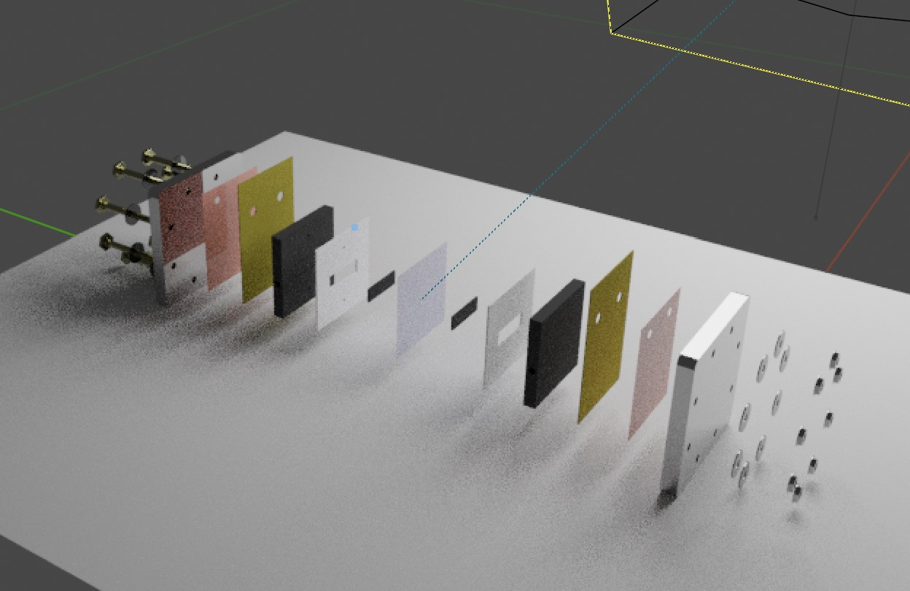
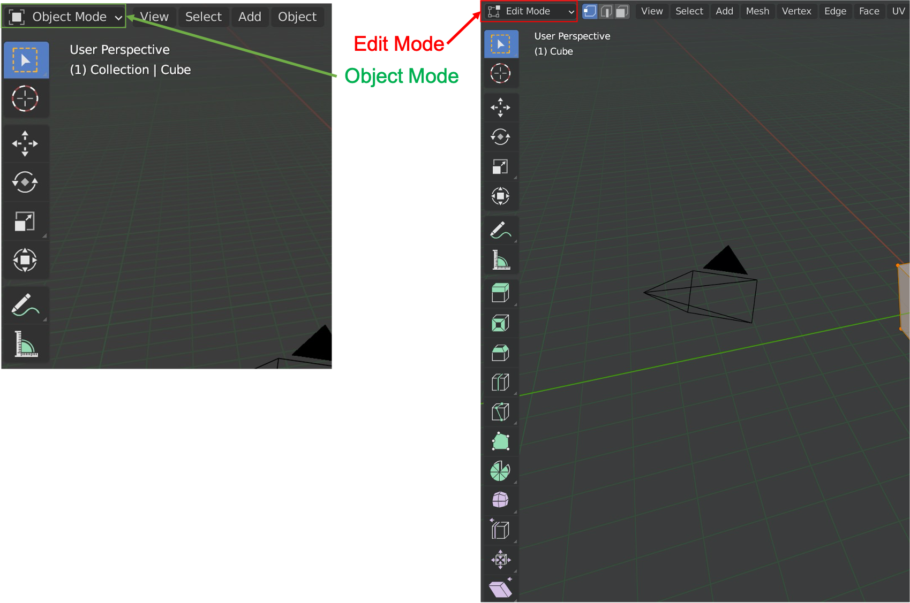
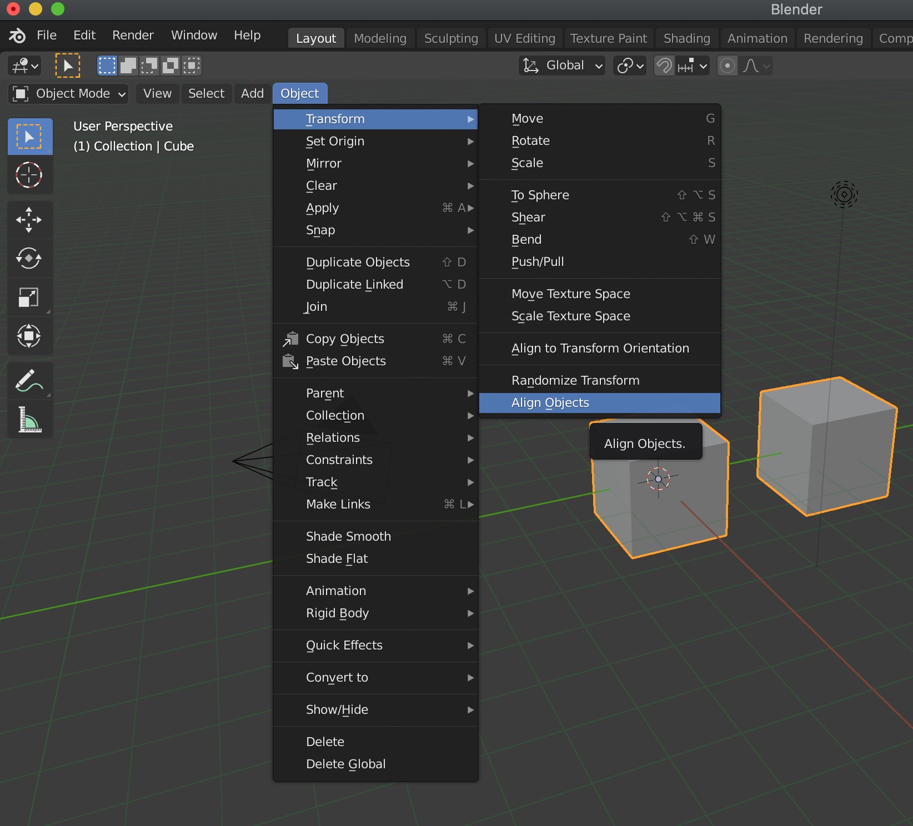
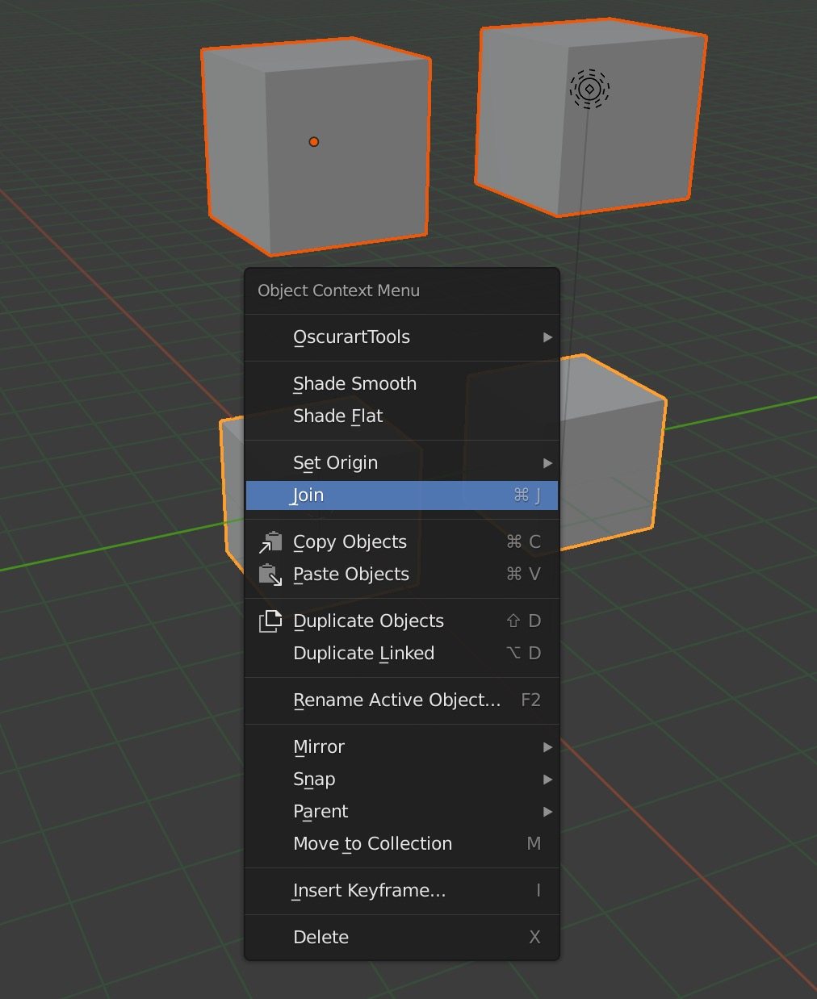
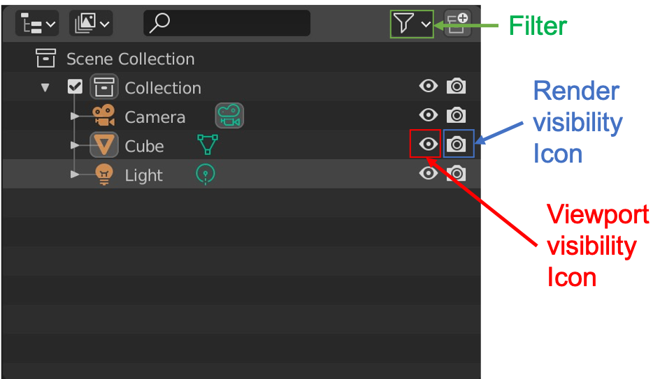
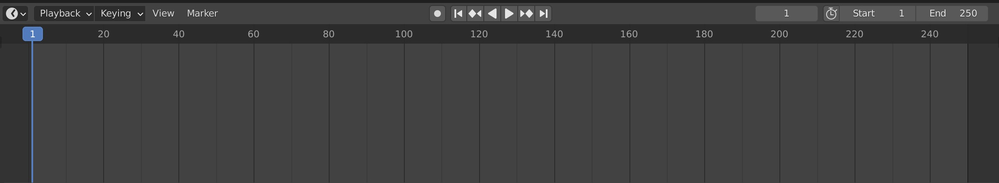
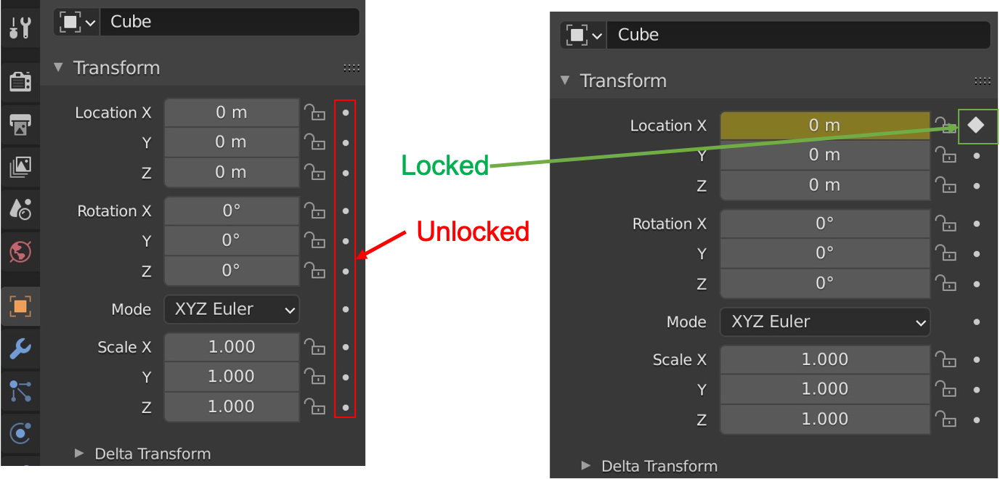
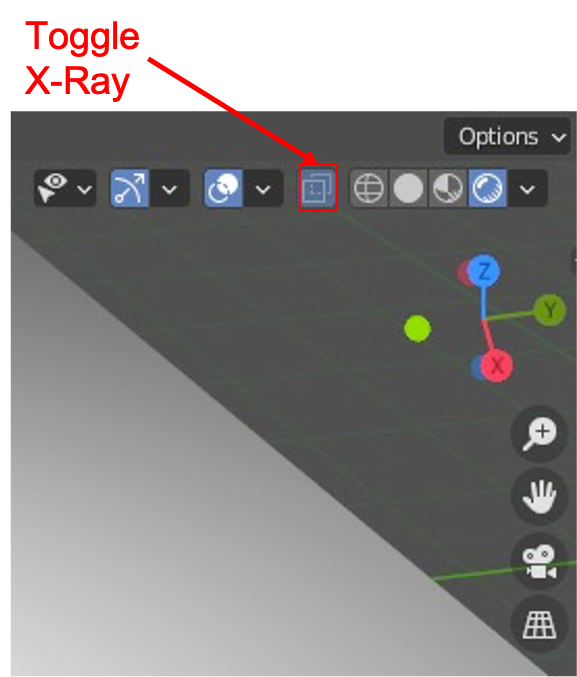
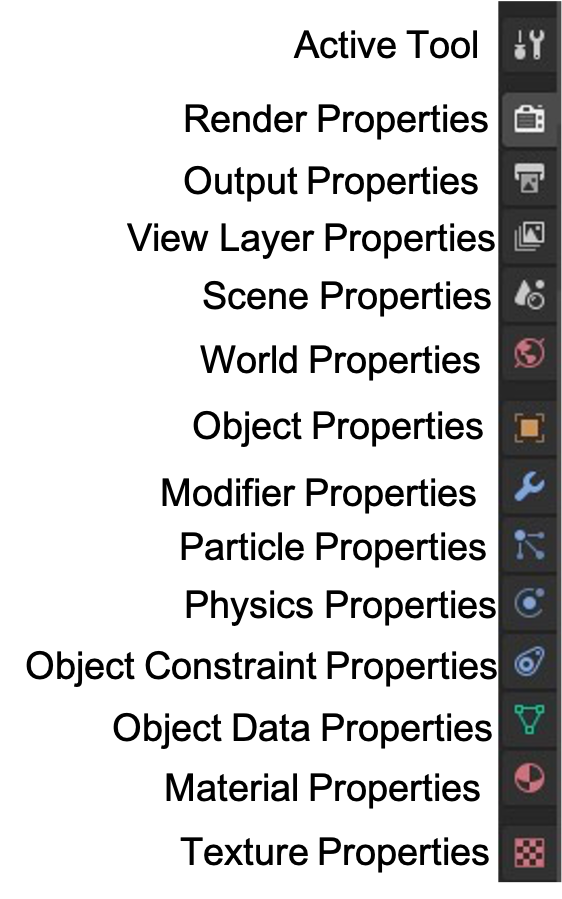

# Blender VRFB Quick Reference

This reference guide and these supplemental materials are associated with [this](https://www.youtube.com/watch?v=gh70s7CWang&feature=youtu.be) video tutorial.

---

<!-- Table of Contents -->
### Contents
  - [Installing Blender](#installing-blender)
    - [Command Line (via brew)](#command-line)
    - [From Blender website](#from-blender-website)
  - [Workflow](#workflow)
  - [Keystrokes and Tips](#keystrokes-and-tips)
      - [Mode toggling](#mode-toggling)
      - [Move along exclusive axis](#move-along-exclusive-axis)
      - [Alignment](#alignment)
        - [With vertices](#with-vertices)
        - [On a plane](#on-a-plane)
      - [Join](#join)
      - [Object visibility](#object-visibility)
        - [Viewport](#viewport)
        - [Rendering](#rendering)
      - [Camera](#camera)
        - [Camera mode](#camera-mode)
        - [Follow path](#follow-path)
        - [Switch camera](#switch-camera)
        - [Track](#track)
      - [Flexible Cylinder](#flexible-cylinder)
      - [Add vertex to bezier curve](#add-vertex-to-bezier-curve)
      - [Add plane](#add-plane)
      - [Material](#material)
      - [Keyframes](#keyframes)
      - [Setting part origin](#setting-part-origin)
      - [Glass](#glass)
  - [Properties Pane](#properties-pane)
<!-- Table of Contents -->

# Installing Blender

## Command Line

If you do not have brew ("the missing package manager for macOS") installed on mac, you can follow [this link](https://brew.sh/) to install it. 

Once you have brew installed, you can type (in a terminal):

    $ brew cask install blender

Once it is installed you should be able to open it from *spotlight* and it should be visible alongside your other installed applications.

## From Blender website

This tutorial will be via MacOS, I am using a Macbook pro with MacOS Catalina, but Blender is compatible with many (Windows, Linux, openBSD, etc.) operating systems. I have not tested this process and I would not be surprised if some of the keystrokes are different, but overall this installation method should yield results similar to using brew.

[Here is a link](https://www.blender.org/download/) to the blender website where it can be downloaded.

---

# Workflow

This order of operations is typically how I approach setting up an animation, there can obviously be some modifications to this, but its just a guideline to not be consumed by the complexity of *Blender*.

  1. Import .stl file(s)
  2. (If needed) Scale to accurate physical dimensions
  3. Material specification and selection
  4. Align objects
  5. If parts are moving (not just camera)
      - KeyFrame the first frame
      - KeyFrame the last frame
  6. Determine the camera settings (motion/position of camera)
  7. Use Eevee render engine while debugging
  8. Look at the shading in shading mode (adjust lighting)
  9. Render

---

# Keystrokes and Tips
In order to distinguish between directions, key presses and selectable options, the following instructions will be denoted by:
  - Directions in single quotations:
    - e.g. 'Select object with left click'
  - Key presses in bold
    - e.g. **shift + s**
  - Selectable options
    - e.g. *Object* &#8594; *Transform* &#8594; ...

The right arrow symbol (&#8594;) is used to indicate progressing through menu sub-levels.

---

### Mode toggling
The upper left corner displays which mode is selected:

Toggle between object and edit modes with:
  1. 'Select object'   
  2.  **tab**

Object mode is the default mode. Edit mode exposes the vertices of an object's mesh so they can be individually selected. 

---
### Move along exclusive axis

  1. 'Select object'
  2. Type **g** followed by the direction (e.g. **gy** will allow you to move an object exclusively in the y-direction)

---
### Alignment
#### With vertices

[Here is a link](https://www.youtube.com/watch?v=GrZF52_5rME) to a video explaining how to align objects. You can use it to achieve the equivalent of a 'concentric' constraint in typical CAD software

If an object's origin (shows up as an orange dot) is not in its center of volume see: [Setting part origin](#setting-part-origin)

Align arbitrary vertices on a mesh:

  1. Select object
  2. Go into edit mode (**tab**)
  3. Select the vertex (or vertices) with a left-click
  4. **shift** + **s** &#8594; *move cursor to selected*
  5. Select object to move to the alignment point with a left-click
  6. **shift** + **s** &#8594; *move selected to cursor*

#### On a plane

This is to align several objects on a common plane

  1. Select objects 
  2. In the top left near the top click 
      - *Object* &#8594; *Transform* &#8594; *Align Objects*

This opens a dialogue box in the lower left to select which plane, etc.

---
### Join
It can simplify certain aspects of a rendering by joining like components together to represent them as a single object in the collection tree (e.g. a set of bolts or washers ...). 
To achieve this:
  1. Select multiple objects by 'left-clicking' while holding **shift**
  2. 'Right-click' and select *join*

---
### Object visibility

#### Viewport
The eye icon toggles objects visibility in the viewport

#### Rendering
The camera icon toggles objects visibility in render mode

Note:
If the camera icon is not visible it can be made visible with:
  - *Filter* &#8594; *Disable in renders*

---
### Camera
#### Camera mode
This shows the view from the camera

  - Numpad 0

Note that many of the camera settings are accessed by selecting the camera (object) and clicking the *Object Data Properties* in the [Properties Pane](#properties-pane) (the icon looks like a camera and is where the material icon is for objects and light is for lights)

  - to move the camera in camera mode press g (don't hold)
#### Follow path 

  1. 'Create a path (curve)' (*Object Mode*: *Add* &#8594; *Curve*)
  2. 'Select follower' (child)
  3. **shift** + 'Select path (curve)' (parent)
  4. **ctrl + p**
  5. *Follow Path*

Now the object will follow this path, but can still have an offset from the path. You can use the 3D cursor to center the object on the path.

To cancel the *follow path*:

  1. 'Select the camera' (child)
  2. 'Select transform properties' in the [Properties Pane](#properties-pane)
  3. *Relations*
  4. 'delete parent constraint'

#### Switch camera
  1. 'Select the new camera'
  2. **ctrl** + Numpad 0

#### Track
This centers the camera focus toward an object (origin) as it moves 

  1. 'Select the camera'
  2. (In the [Properties Pane](#properties-pane)): *Object constraint properties* &#8594; *Add object constraints* &#8594; *Track to* 
  3. *Target* &#8594; 'Select the object for the camera to track'

---
### Flexible Cylinder

This is how I created pump tubing without drawing it in CAD software so it would be easier to geometrically manipulate:
  1. *Object mode* &#8594; *Add* &#8594; *Curve* &#8594; *Circle*
  2. *Object mode* &#8594; *Add* &#8594; *Curve* &#8594; *Bezier*
  3. In "object data properties" (looks like bezier curve symbol in [Properties Pane](#properties-pane)); *geometry* &#8594; *bevel* &#8594; *object* &#8594; 'select the bezier circle you just created'
  4. 'Select curve'
  5. **tab** 
  6. *Object* &#8594; *Convert to* &#8594; *Mesh from curve*

Now the spline is converted to a mesh that is cylindrical with a diameter linked to the diameter of the bezier circle

[Tip: add another vertex with extrusion](#add-vertex-to-bezier-curve)

---
### Add vertex to bezier curve

This method will add a vertex past the final vertex, so the selected vertex
will become "inner" and not the end vertex

  1. 'Select curve'
  2. **tab** (enter edit mode)
  3. 'select end vertex'
  4.  **E** (extrude)

---
### Add plane
Add a plane below a model to catch the shadow the model creates 
  - *Object Mode*: *Add* &#8594; *Mesh* &#8594; *Plane*

---
### Material 

This menu has all the options for material specifications.

NOTE: make sure that you have scaled the object to its accurate physical
size or light will not interact with it the way you expect

  - In the [Properties Pane](#properties-pane) &#8594; *Material Properties*

---
### Keyframes 

Keyframes attach objects to 3D space at specific times. These instructions are for basic (linear space-time) motion between orientation time1 and time2.

  1. 'Select an object'
  2. In the [Properties pane](#properties-pane) click 'Object Properties'; This will show the location, rotation, mode and scale.
  3. To the right of these are locks and diamonds
  4. The slider at the bottom of the screen is associated with the time of the animation (note that the frames per-second will determine how many seconds each frame is [Default is 24 frames per second])
  5. 'Adjust the slider to the time you want to orient the object' (time1)
  6. 'Click the circle to the right of the lock' to lock object's position (or rotation, or scale) in the frame
  7. 'Move the slider to time2
  8. 'move / scale / rotate the part' to where it will be at time_2
  9. 'Select the diamond' again and the object will move (linearly)
    between the two points in the time which you specified.

Slider:

Locked/Unlocked objects:

---
### Setting part origin

Set origin to arbitrary center of mass/volume
  1. 'Right click' &#8594; *Set origin center of mass/volume*

Set origin to arbitrary mesh vertex:
  1. **tab** (Edit mode)
  2. 'select vertex'
  3. **shift + s** &#8594; *Cursor to selected*
  4. **tab** (Object mode)
  5. 'right click the object' &#8594; *Set origin* &#8594; *Origin to 3D cursor*

---

### Glass

I used [this](https://www.youtube.com/watch?v=HmohExOAsW0) tutorial to make axisymmetric glass.

The main takeaways are:
  1. import a 2-dimensional image of the glassware (you can drag and drop (left click) an image from your desktop into blender)
  2. in object mode: *Add* &#8594; *Mesh* &#8594; *Cylinder*
  3. 'scale and align cylinder with image'
     - Note: you should use the orthographic view so that you can align your cylinder correctly. You can select the 2D image and *Toggle X-ray* to allow selection of vertices behind the object (image).

  4. **tab** ('enter edit mode')
  5. 'Delete top and bottom faces of cylinder'
      - 'Select all edge vertices of a face'
      - **delete**
      - *Faces*
  6. Iterative steps:
      - 'select vertex group to extrude' (left click and drag)
      - **e** (extrude)
      - 'move vertices in desired direction'
      - (when needed): **s** (scale) 'scale the vertices to make them trace the contour of the image'
  7. *Modifier Properties* &#8594; *Add Modifier*  &#8594; *Solidify*
  8. 'Set *thickness*' 
  9. *Material Properties* &#8594; *Surface* &#8594; *Glass BSDF*

# Properties Pane

